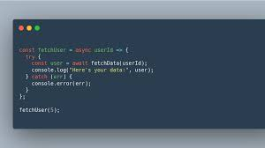
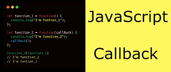
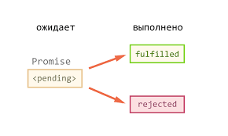
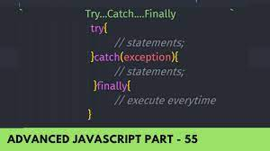

# Homework
## _Synchronous vs Asynchronous programming_

## _Synchronous_
### Synchronous code runs in sequence. This means that each operation must wait for the previous one to complete before executing.

## _Asynchronous_

### Asynchronous code runs in parallel. This means that an operation can occur while another one is still being processed.
----------------------------------------------------------------------------
## _SetTimeout()_
.png)
### The setTimeout() method executes a block of code after the specified time. The method executes the code only once.

## _SetInterval()_
.jpg)
### he setInterval() method, offered on the Window and Worker interfaces, repeatedly calls a function or executes a code snippet, with a fixed time delay between each call.

##  _CallBack_

### A function is a block of code that performs a certain task when called.

## Promise

### The Promise() constructor takes a function as an argument. The function also accepts two functions resolve() and reject().
### To create a promise object, we use the Promise() constructor.

## Try/catch/finally

### The try...catch statement is comprised of a try block and either a catch block, a finally block, or both. The code in the try block is executed first, and if it throws an exception, the code in the catch block will be executed.

## async function

### The async function declaration declares an async function where the await keyword is permitted within the function body. The async and await keywords enable asynchronous, promise-based behavior to be written in a cleaner style, avoiding the need to explicitly configure promise chains.

## Async await

### The await keyword is used inside the async function to wait for the asynchronous operation.
### The use of await pauses the async function until the promise returns a result (resolve or reject) value

## Catch()
.png)
### While using the async function, you write the code in a synchronous manner. And you can also use the catch() method to catch the error.  

